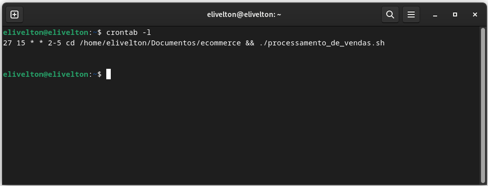

# Processamento e Consolidação de Relatórios de Vendas

## Descrição

Este projeto foi desenvolvido com o objetivo de automatizar o processamento diário de vendas e gerar um relatório consolidado ao final de um período. Ele envolve dois scripts principais:

* __processamento_de_vendas.sh__: Responsável por processar os dados de vendas diários e gerar relatórios em arquivos .txt.

* __consolidador_de_processamento_de_vendas.sh__: Responsável por consolidar os relatórios diários em um arquivo final chamado relatorio_final.txt.

## 1.  Script de Processamento de Vendas

### processamento_de_vendas.sh

Este script realiza as seguintes etapas:

* __Criação de Diretórios__: Cria um diretório chamado vendas e um subdiretório backup para armazenar os dados processados.
* __Cópia de Arquivos__: Copia o arquivo de vendas original para a pasta de vendas.
* __Geração de Relatórios Diários__: Cria um arquivo de backup dos dados de vendas com a data do processamento e gera um relatório com informações detalhadas.

[Script_processamento_de_vendas](../Evidencias/Script_processamento_vendas.png)

## Relatório Gerado

O relatório diário contém informações como:

* Data do Sistema Operacional
* Data do Primeiro Registro de Venda
* Data do Último Registro de Venda
* Total de Itens Vendidos
* Primeiras 10 Linhas do Arquivo de Backup

Exemplo de Relatório Diário:

[Relatório de Vendas](../Evidencias/Ex_relatorio_vendas.png)

## Compactação e Limpeza

Após gerar o relatório, o script compacta o arquivo de vendas e remove o arquivo original para liberar espaço.

[Trecho do código para compactação](../Evidencias/Compactacao_de_arquivo.png)

## 2. Script de Consolidação de Vendas

### consolidador_de_processamento_de_vendas.sh

Esse script consolida os relatórios diários gerados pelo primeiro script em um único arquivo relatorio_final.txt. Ele coleta todos os arquivos relatorio*.txt e combina suas informações em um formato legível para o cliente.

Exemplo de Código:

[Script Consolidador](../Evidencias/Script_consolidador.png)

Exemplo de Relatório Consolidado:

[Relatório Final](../Evidencias/Relatório_final.png)

## 3. Execução do Script com Cron

Para garantir que o processamento de vendas seja executado automaticamente nos dias úteis, o crontab foi configurado. O seguinte comando foi usado para agendar a execução do script de processamento:

Isso significa que o script será executado às 15:27 de terça a sexta-feira.

## 4. Dificuldades Encontradas e Soluções

__Nomeação dos Relatórios:__ Tive que ajustar o formato dos nomes dos arquivos para garantir que o relatório final não fosse incluído acidentalmente no processo de consolidação. Isso foi resolvido utilizando uma combinação de sed para manipular strings.

__Execução Automática:__ Garantir que o crontab fosse configurado corretamente para executar os scripts nos horários e dias certos exigiu alguns testes, mas foi ajustado para funcionar de terça a sexta.

## 5. Execução do Projeto

### Passo a Passo

1. Coloque o arquivo de vendas dados_de_vendas.csv no diretório ecommerce.

2. Execute o script processamento_de_vendas.sh para processar as vendas diárias.

3. O crontab pode ser configurado para executar automaticamente o script em dias úteis.

4. Após o período de processamento, execute o script consolidador_de_processamento_de_vendas.sh para consolidar todos os relatórios em um único arquivo.

5. O arquivo final será salvo como relatorio_final.txt no diretório backup.

## 6. Resultados e Benefícios

__Automatização:__ O processo de geração de relatórios foi automatizado, eliminando a necessidade de processamento manual.

__Organização:__ Os dados de vendas são organizados e compactados de forma eficiente, reduzindo o espaço em disco utilizado.

__Relatórios Consolidados:__ O cliente recebe um relatório final detalhado e legível, contendo todos os dados processados durante o período.
