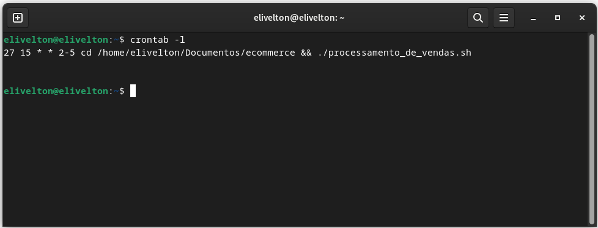

# Sprint 1

## Linux Git e GitHub

### Curso de Linux (Distribuição Ubuntu)

Neste curso, aprendi sobre o sistema operacional Linux, com foco na distribuição Ubuntu, que é amplamente utilizada no mercado. O curso abordou desde os conceitos fundamentais até o gerenciamento de diretórios e arquivos, configuração de ambientes de desenvolvimento e servidores de produção.

#### Os principais tópicos incluídos foram

- Fundamentos do Linux: Comandos essenciais e principais conceitos.
- Gerenciamento de Pacotes: Instalação, remoção e atualização de aplicativos.
- Gerenciamento de Usuários e Permissões: Compreensão do controle de acesso e administração de usuários.
- Ambiente LAMP: Instalação e configuração de um ambiente de desenvolvimento.
- Além de proporcionar uma base sólida em Linux, o curso também incluiu dicas valiosas que aumentaram minha produtividade e compreensão do sistema. A combinação de teoria e prática foi especialmente útil, permitindo que eu aplicasse os conhecimentos adquiridos em situações reais.

### Curso de Git e GitHub

O segundo curso, voltado para Git e GitHub, foi igualmente enriquecedor. A abordagem prática me ensinou a usar essas ferramentas de controle de versão de maneira eficaz, desde os conceitos mais básicos até técnicas avançadas.

#### Os principais pontos abordados foram

- Comandos Git: Desde os fundamentos até as práticas mais avançadas aplicadas ao dia a dia de um desenvolvedor.
- GitHub: Uso completo, incluindo Issues, Pull Requests, Code Review e muito mais.
- Criação de Portfólio: Desenvolvimento e hospedagem de um portfólio utilizando GitHub Pages, marcando minha presença na web.
- Além de adquirir habilidades valiosas em gerenciamento de projetos, a criação de documentos incríveis com Markdown foi um destaque que me permitirá apresentar informações de maneira clara e organizada.

## Evidências

Script de de Processamento de vendas

Script Consolidador de vendas executado manualmente após os quatro dias de processamento de venda

Estrutura criada após os quatros dias de processamento de vendas e executado o consolidador

Código do agendamento feito no Crontab

Relatório de Vendas gerado com script

