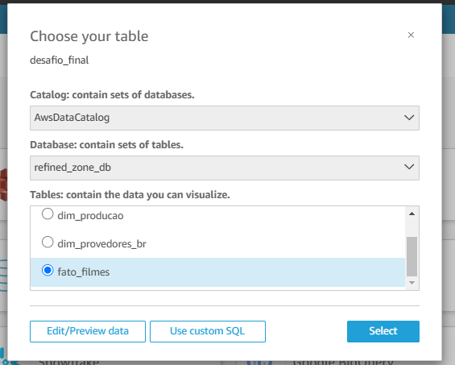
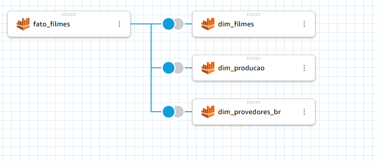
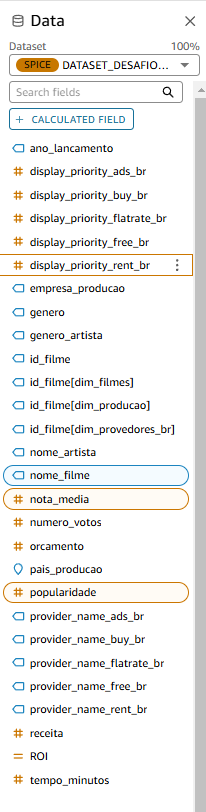
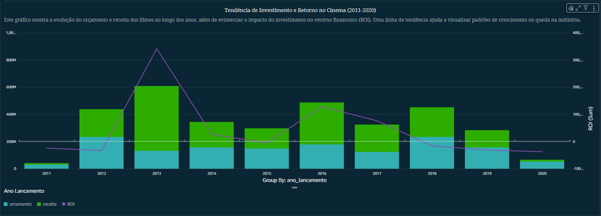
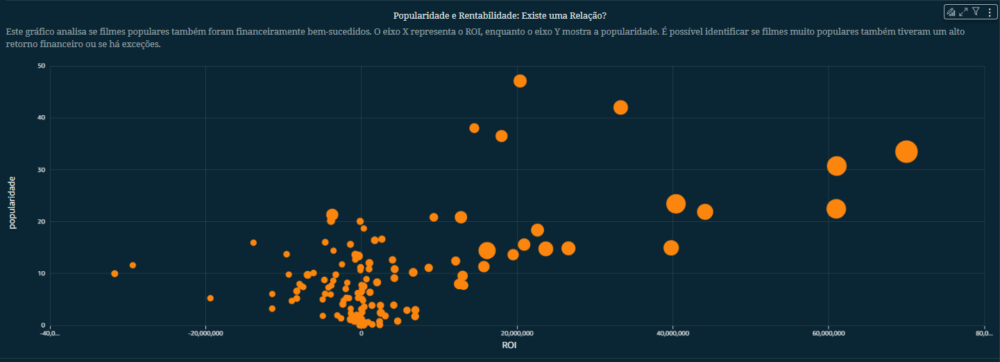
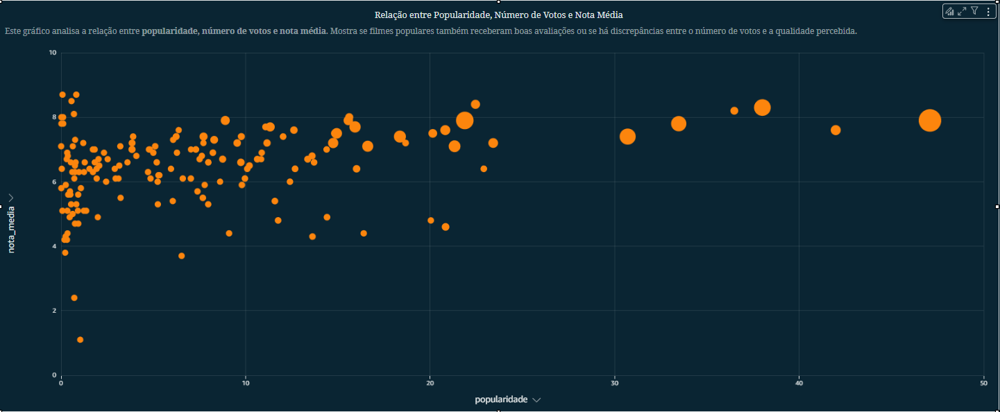
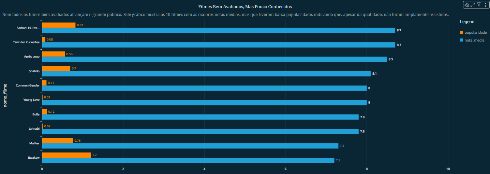
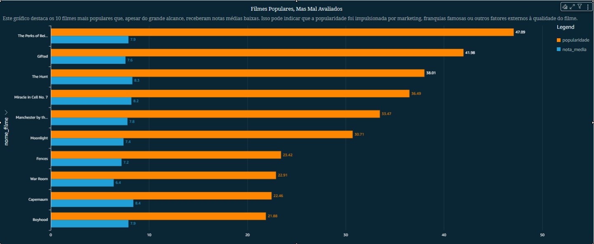

# 📊 Dashboard do Desafio final - Análise Financeira e Popularidade de Filmes (2011-2020)

O processo de criação do dashboard de análise financeira e popularidade de filmes utilizando AWS Athena, S3 e QuickSight.
O objetivo foi explorar a relação entre investimento, rentabilidade e avaliação do público nos filmes lançados entre 2011 e 2020.

## 🎯 Objetivos do Dashboard

✔ Avaliar a evolução do orçamento e receita dos filmes ao longo dos anos.

✔ Identificar se filmes populares também foram financeiramente bem-sucedidos.

✔ Analisar a relação entre popularidade e nota média dos filmes.

✔ Identificar filmes altamente bem avaliados, mas pouco conhecidos.

✔ Identificar filmes populares, mas mal avaliados pelo público.

## Importação de Dados via AWS Athena no S3

Os dados armazenados em um bucket no AWS S3 na pasta REFINED já em seu **modelo dimensional** para otimizar as pesquisas.

**Tabelas utilizadas:**

- Fato_Filmes (dados financeiros e de popularidade).
- Dim_Filmes (informações sobre os filmes).
- Dim_Producao (empresas e países de produção).

E usando o AWS QuickSight importamos as tabelas atraves do Athena.

Junção da tabela Fato com as dimensões 

Tabela com todas as colunas:

## Perguntas que o Dashboard Responde

Após a importação dos dados, definimos perguntas-chave que o dashboard deveria responder:

- Qual foi a tendência de orçamento e receita ao longo dos anos?
- Filmes populares também foram os mais rentáveis?
- Como a nota média dos filmes variou ao longo dos anos?
- Filmes populares também receberam boas avaliações?
- Quais são os filmes mais bem avaliados, mas pouco conhecidos?
- Quais filmes foram populares, mas receberam notas baixas?

## Desenvolvimento dos Gráficos no QuickSight

### 📊 Gráfico 1: Tendência de Investimento e Retorno no Cinema (2011-2010)

📌 Pergunta Respondida: Como orçamento e receita evoluíram ao longo do tempo?

🔎 **Insight:** A indústria do cinema nem sempre acompanha uma tendência de crescimento estável. Grandes investimentos podem gerar grandes bilheterias, mas alguns filmes fracassaram financeiramente.

### 📊 Gráfico 2: Popularidade x Rentabilidade

📌 Pergunta Respondida: Filmes populares também foram financeiramente bem-sucedidos?

🔎 **Insight:** A popularidade nem sempre está atrelada ao sucesso financeiro. Algumas produções ganharam atenção do público, mas falharam em termos de retorno financeiro.

### 📊 Gráfico 3: Tendência de Popularidade e Nota Média

📌 Pergunta Respondida: A nota média dos filmes mudou ao longo dos anos?

🔎 **Insight:** A qualidade percebida dos filmes não seguiu uma tendência linear. Alguns anos registraram filmes melhor avaliados, enquanto outros tiveram queda na nota média.

### 📊 Gráfico 4: Relação entre Popularidade, Número de Votos e Nota Média

📌 Pergunta Respondida: Filmes populares também receberam boas avaliações?

🔎 **Insight:** A maior concentração de filmes está na faixa de nota média entre 6 e 8 e popularidade abaixo de 20.Alguns filmes com alta popularidade têm notas baixas, enquanto outros, menos populares, receberam avaliações muito boas. O tamanho dos pontos mostra que filmes com maior número de votos nem sempre têm as melhores notas.

### 📊 Gráfico 5: Filmes Bem Avaliados, Mas Pouco Conhecidos

📌 Pergunta Respondida: Quais filmes tiveram altas notas, mas pouca popularidade?

🔎 **Insight:** Muitos filmes de alta qualidade passam despercebidos pelo grande público. Nem sempre uma boa avaliação significa sucesso comercial.

### 📊 Gráfico 6: Filmes Populares, Mas Mal Avaliados

 Pergunta Respondida: Quais filmes foram muito assistidos, mas receberam notas baixas?

 

 🔎 **Insight:** A popularidade nem sempre reflete qualidade. Alguns filmes podem ser grandes sucessos comerciais, mas fracassam em avaliações do público e crítica.

 ## Estrutura Final do Dashboard

 [dashboard_final](../Desafio/dashboard_final.pdf)

 ## Conclusões da Análise

### 🎯 Resumo dos Insights:

✔ Grandes investimentos nem sempre significam grandes lucros.

✔ Filmes populares não são necessariamente os mais rentáveis.

✔ O público manteve um padrão de avaliação estável ao longo dos anos.

✔ Muitos filmes de alta qualidade passaram despercebidos.

✔ Alguns filmes foram muito assistidos, mas tiveram avaliações ruins.

📌 Reflexão Final:

O mercado cinematográfico é complexo e imprevisível.
Essa análise permite compreender padrões e tomar melhores decisões sobre produção, marketing e distribuição de filmes.

🚀 Com esses dados, estúdios, distribuidores e produtores podem ajustar suas estratégias para maximizar o sucesso financeiro e de público!