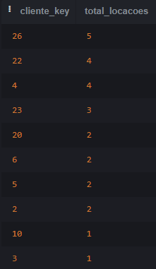
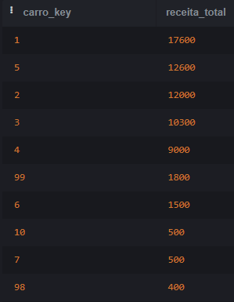
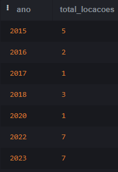
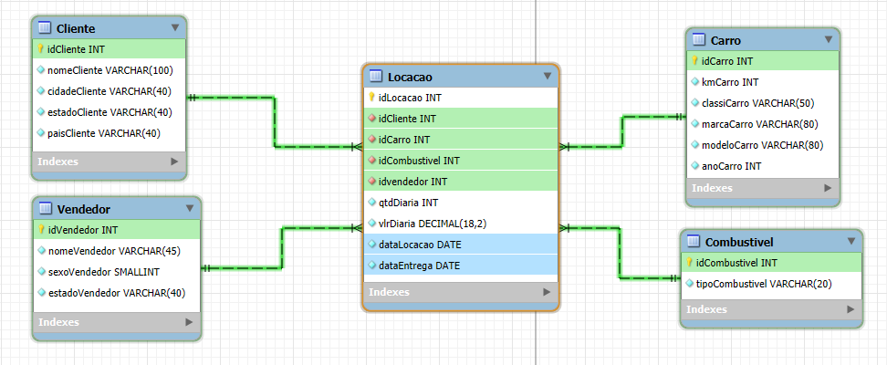
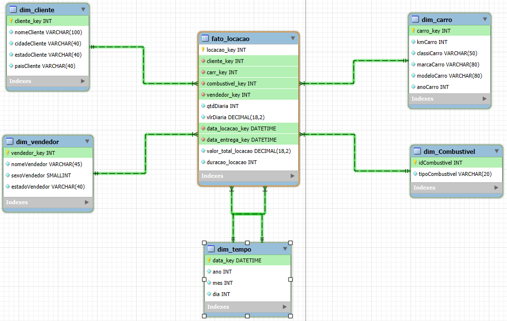
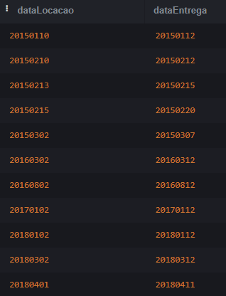
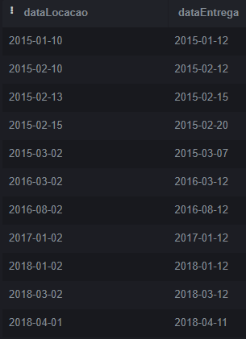

# Documentação do Processo de Modelagem: Banco Relacional e Dimensional

## Descrição Geral

Este projeto envolve a modelagem de um banco de dados relacional e sua conversão para um modelo dimensional. O objetivo principal foi criar uma estrutura eficiente tanto para operações transacionais quanto para consultas analíticas, garantindo consistência e performance. A partir de um banco de dados inicial, aplicamos normalização para eliminar redundâncias e depois criamos um modelo dimensional, baseado em um esquema estrela, para otimizar consultas e relatórios analíticos.

Os principais passos do projeto foram:
1. Normalização do banco de dados relacional.
2. Conversão do banco normalizado para um modelo dimensional.
3. Criação de tabelas de fatos e dimensões para facilitar análises.
4. Correção de problemas com formatação de datas e horas.

---

## Scripts SQL Gerados

### Criação do Banco Relacional Normalizado

Para criar o banco relacional, foram aplicadas as três primeiras formas normais (1FN, 2FN e 3FN). O objetivo dessas formas é eliminar redundâncias, garantindo que cada tabela possua dados atômicos e evitando dependências parciais e transitivas.

- 1ª Forma Normal: Garantimos que os atributos de cada tabela contivessem valores atômicos (sem múltiplos valores em uma única célula).
- 2ª Forma Normal: Removemos dependências parciais, criando tabelas separadas para entidades independentes, como clientes, carros e vendedores.
- 3ª Forma Normal: Garantimos que todos os atributos dependessem unicamente da chave primária, removendo qualquer dependência transitiva.

Abaixo está o script SQL usado para criar o banco relacional normalizado:

```sql
CREATE TABLE Cliente (
    idCliente INT PRIMARY KEY,
    nomeCliente VARCHAR(100),
    cidadeCliente VARCHAR(40),
    estadoCliente VARCHAR(40),
    paisCliente VARCHAR(40)
);

-- Tabela Carro
CREATE TABLE Carro (
    idCarro INT PRIMARY KEY,
    kmCarro INT,
    classiCarro VARCHAR(50),
    marcaCarro VARCHAR(80),
    modeloCarro VARCHAR(80),
    anoCarro INT
);

-- Tabela Combustível
CREATE TABLE Combustivel (
    idCombustivel INT PRIMARY KEY,
    tipoCombustivel VARCHAR(20)
);

-- Tabela Vendedor
CREATE TABLE Vendedor (
    idVendedor INT PRIMARY KEY,
    nomeVendedor VARCHAR(15),
    sexoVendedor SMALLINT,
    estadoVendedor VARCHAR(40)
);


-- Tabela Locação
CREATE TABLE Locacao (
    idLocacao INT PRIMARY KEY,
    idCliente INT,
    idCarro INT,
    idCombustivel INT,
    idVendedor INT,
    dataLocacao DATETIME,
    horaLocacao TIME,
    qtdDiaria INT,
    vlrDiaria DECIMAL(18, 2),
    dataEntrega DATE,
    horaEntrega TIME,
    FOREIGN KEY (idCliente) REFERENCES Cliente(idCliente),
    FOREIGN KEY (idCarro) REFERENCES Carro(idCarro),
    FOREIGN KEY (idCombustivel) REFERENCES Combustivel(idCombustivel),
    FOREIGN KEY (idVendedor) REFERENCES Vendedor(idVendedor)
);
```

### Criação do Banco Dimensional

Após a normalização, converti o banco para um modelo dimensional, criando views para as dimensões e a tabela de fatos. Esse modelo foi escolhido para otimizar consultas analíticas e de relatórios. As views para as dimensões permitem agrupar informações de maneira eficaz e realizar consultas de forma rápida, utilizando um esquema estrela.

```sql
-- Dimensão de Cliente
CREATE VIEW dim_cliente AS
SELECT 
    idCliente AS cliente_key,
    nomeCliente,
    cidadeCliente,
    estadoCliente,
    paisCliente
FROM Cliente;

-- Dimensão de Carro
CREATE VIEW dim_carro AS
SELECT 
    idCarro AS carro_key,
    kmCarro,
    classiCarro,
    marcaCarro,
    modeloCarro,
    anoCarro
FROM Carro;

-- Dimensão de Vendedor
CREATE VIEW dim_vendedor AS
SELECT 
    idVendedor AS vendedor_key,
    nomeVendedor,
    sexoVendedor,
    estadoVendedor
FROM Vendedor;

-- Dimensão de Combustível
CREATE VIEW dim_combustivel AS
SELECT 
    idCombustivel AS combustivel_key,
    tipoCombustivel
FROM Combustivel;

-- Dimensão de Tempo (baseada nas datas de locação e entrega)
CREATE VIEW dim_tempo AS
SELECT DISTINCT
    dataLocacao AS data_key,
    strftime('%Y', dataLocacao) AS ano,
    strftime('%m', dataLocacao) AS mes,
    strftime('%d', dataLocacao) AS dia,
    CASE
        WHEN strftime('%w', dataLocacao) = '0' THEN 'Domingo'
        WHEN strftime('%w', dataLocacao) = '1' THEN 'Segunda-feira'
        WHEN strftime('%w', dataLocacao) = '2' THEN 'Terça-feira'
        WHEN strftime('%w', dataLocacao) = '3' THEN 'Quarta-feira'
        WHEN strftime('%w', dataLocacao) = '4' THEN 'Quinta-feira'
        WHEN strftime('%w', dataLocacao) = '5' THEN 'Sexta-feira'
        WHEN strftime('%w', dataLocacao) = '6' THEN 'Sábado'
    END AS dia_semana,
    strftime('%m', dataLocacao) AS mes_numero,
    CASE 
        WHEN strftime('%m', dataLocacao) = '01' THEN 'Janeiro'
        WHEN strftime('%m', dataLocacao) = '02' THEN 'Fevereiro'
        WHEN strftime('%m', dataLocacao) = '03' THEN 'Março'
        WHEN strftime('%m', dataLocacao) = '04' THEN 'Abril'
        WHEN strftime('%m', dataLocacao) = '05' THEN 'Maio'
        WHEN strftime('%m', dataLocacao) = '06' THEN 'Junho'
        WHEN strftime('%m', dataLocacao) = '07' THEN 'Julho'
        WHEN strftime('%m', dataLocacao) = '08' THEN 'Agosto'
        WHEN strftime('%m', dataLocacao) = '09' THEN 'Setembro'
        WHEN strftime('%m', dataLocacao) = '10' THEN 'Outubro'
        WHEN strftime('%m', dataLocacao) = '11' THEN 'Novembro'
        WHEN strftime('%m', dataLocacao) = '12' THEN 'Dezembro'
    END AS mes_nome
FROM Locacao;

--Fato Locacao
CREATE VIEW fato_locacao AS
SELECT 
    L.idLocacao AS locacao_key,
    C.idCliente AS cliente_key,
    A.idCarro AS carro_key,
    V.idVendedor AS vendedor_key,
    B.idCombustivel AS combustivel_key,
    L.qtdDiaria,
    L.vlrDiaria,
    L.dataLocacao AS data_locacao_key,
    L.dataEntrega AS data_entrega_key,
    -- Métrica calculada (valor total da locação)
    (L.qtdDiaria * L.vlrDiaria) AS valor_total_locacao,
    -- Métrica calculada (duração da locação (em dias))
    JULIANDAY(L.dataEntrega) - JULIANDAY(L.dataLocacao) AS duracao_locacao
FROM Locacao L
JOIN Cliente C ON L.idCliente = C.idCliente
JOIN Carro A ON L.idCarro = A.idCarro
JOIN Vendedor V ON L.idVendedor = V.idVendedor
JOIN Combustivel B ON L.idCombustivel = B.idCombustivel;
```

---

## Consultas para Demonstração de Eficiência

Após a conversão para o modelo dimensional, foram realizadas consultas analíticas que demonstram a eficiência do modelo em relação ao tempo de execução e ao uso de recursos. Abaixo estão alguns exemplos de consultas:

### Contagem de Locações por Cliente

Esta consulta demonstra como o modelo dimensional otimiza a busca por dados agregados (como o número de locações por cliente), reduzindo a necessidade de joins complexos no banco relacional.

``` sql
SELECT cliente_key, COUNT(locacao_key) AS total_locacoes
FROM fato_locacao
GROUP BY cliente_key
ORDER BY total_locacoes DESC;
```



### Receita Total por Carro

Esta consulta calcula a receita total por carro, mostrando como o modelo dimensional facilita o cálculo de métricas como o valor total da locação.

``` sql
SELECT carro_key, SUM(valor_total_locacao) AS receita_total
FROM fato_locacao
GROUP BY carro_key
ORDER BY receita_total DESC;
```



### Análise Temporal

Utilizando a tabela de tempo, podemos fazer uma análise de quantas locações ocorreram em um determinado ano.

``` sql
SELECT ano, COUNT(locacao_key) AS total_locacoes
FROM fato_locacao
JOIN dim_tempo ON fato_locacao.data_locacao_key = dim_tempo.data_key
GROUP BY ano
ORDER BY ano;
```




---

## Diagrama UML do Banco Relacional



## Diagrama UML do Banco Dimensional



---

## Dificuldades Encontradas

Durante o processo de modelagem e conversão, algumas dificuldades surgiram, principalmente relacionadas às colunas de datas e horas. Mais especificamente:

- **Problemas com as Colunas `dataLocacao` e `dataEntrega`**: As datas estavam no formato `YYYYMMDD`, o que impedia o uso direto dessas colunas como `DATE`. Foi necessário aplicar transformações com o comando `SUBSTR()` para convertê-las para o formato padrão `YYYY-MM-DD`.

    Como se encontrava na tb_locacao:

    ``` sql
    SELECT tl.dataLocacao, tl.dataEntrega
    FROM tb_locacao tl
    ```
    
  
  Exemplo de conversão utilizada:
  
  ```sql
  -- Correção do formato de data
  SUBSTR(dataLocacao, 1, 4) || '-' || SUBSTR(dataLocacao, 5, 2) || '-' || SUBSTR(dataLocacao, 7, 2) AS dataLocacao
  ```

  Resultado obitido:

  

- **Problemas com as Colunas `horaLocacao` e `horaEntrega`**: Algumas entradas nas colunas de hora estavam no formato `H:MM`, com um dígito a menos. Para corrigir, foi utilizado um `CASE` para adicionar um zero à esquerda quando necessário:

    Como se encontrava na tb_locacao:

    ```sql
    SELECT tl.horaLocacao, tl.horaEntrega
    FROM tb_locacao tl
    ```
    

  ```sql
  CASE 
      WHEN LENGTH(horaLocacao) = 4 THEN '0' || horaLocacao
      ELSE horaLocacao
  END AS horaLocacao
  ```

  Resultado obitido:

  

Essas correções foram essenciais para garantir que os dados fossem corretamente interpretados e processados no banco dimensional.

---

## Importância da Tabela de Tempo no Modelo Dimensional

Uma das decisões mais importantes no modelo dimensional foi a inclusão da **tabela de tempo**. Essa tabela é crucial para análises temporais, permitindo que consultas sejam realizadas com base em diferentes granularidades de tempo (ano, mês, dia, etc.).

A tabela de tempo facilita análises como:
- Quantidade de locações por mês, trimestre ou ano.
- Comparações de desempenho entre diferentes períodos.
  
Ao criar a tabela de tempo, foram incluídas colunas como `ano`, `mês`, `dia`, e até mesmo o nome do dia da semana para otimizar relatórios e consultas temporais.

---

## Resultados e Benefícios Obtidos

A aplicação das formas normais e a conversão para o modelo dimensional trouxeram diversos benefícios, tanto para a empresa quanto para os clientes. Alguns dos principais resultados incluem:

### Para a Empresa:
- **Otimização do Armazenamento**: A normalização eliminou redundâncias, reduzindo o volume de dados armazenados.
- **Performance de Consultas**: O modelo dimensional melhorou significativamente o tempo de execução de consultas analíticas, o que é crucial para a geração de relatórios e análises de grandes volumes de dados.
- **Facilidade de Manutenção**: O banco de dados agora é mais fácil de manter, pois as tabelas estão devidamente organizadas e os dados são armazenados de maneira eficiente.

### Para o Cliente:
- **Respostas Rápidas**: Consultas que antes demoravam mais tempo agora são executadas de forma rápida, proporcionando uma experiência de usuário mais ágil.
- **Análises Temporais Mais Rápidas**: A inclusão da tabela de tempo permitiu a criação de relatórios detalhados, como análise de desempenho por mês, trimestre e ano, otimizando a tomada de decisão.

---
