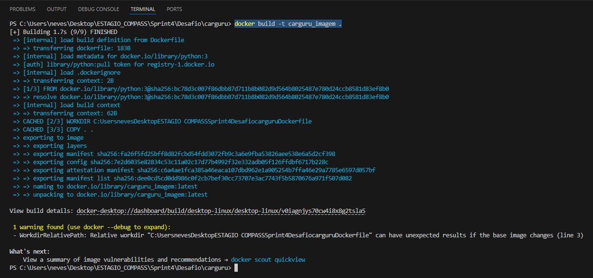
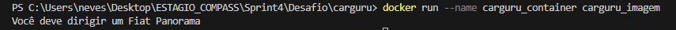
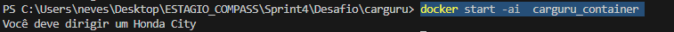
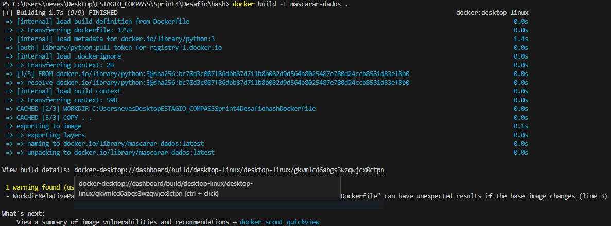
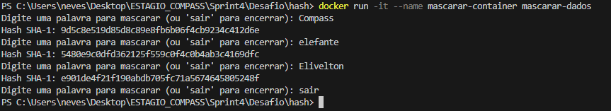

# Desafio Sprint 4 - Projeto Docker para Scripts Python

## Introdução

Este projeto explora o uso do Docker para encapsular e executar scripts Python em ambientes isolados, promovendo portabilidade e reprodutibilidade. Foram desenvolvidos dois subprojetos principais:

 - [Carguru](/Sprint_4/Desafio/carguru/) : Seleciona aleatoriamente um carro de uma lista e imprime o nome.

 - [Mascaramento de Dados com Hash SHA-1](/Sprint_4/Desafio/hash/) : Recebe uma entrada de texto, gera um hash SHA-1, e exibe o valor do hash.

Cada projeto foi configurado para funcionar de maneira autônoma, utilizando containers Docker para execução em qualquer ambiente.

---

## Projeto Carguru

O objetivo deste subprojeto é implementar um script Python que sorteia aleatoriamente o nome de um carro de uma lista pré-definida e exibe o resultado ao usuário. Para isso, foi criado um ambiente Docker contendo o script Python e as dependências necessárias.

### Arquivo Python: carguru.py

O script implementado realiza o sorteio de um carro com base na biblioteca random do Python:

```python
import random

carros = ['Chevrolet Agile','Chevrolet C-10','Chevrolet Camaro','Chevrolet Caravan','Chevrolet Celta','Chevrolet Chevette','Chevrolet Corsa','Chevrolet Covalt','Chevrolet D-20','Chevrolet Monza','Chevrolet Onix','Chevrolet Opala','Chevrolet Veraneio','Citroën C3','Fiat 147','Fiat Argo','Fiat Cronos','Fiat Mobi','Fiat Panorama','Ford Corcel','Ford Escort','Ford F-1000','Ford Ka','Ford Maverick','Honda City','Honda Fit','Hyundai Azera','Hyundai HB20','Hyundai IX-35','Hyundai Veloster','Peugeot 2008','Peugeot 206','Peugeot 208','Peugeot 3008','Peugeot 306','Peugeot 308','Renault Kwid','Renault Logan','Renault Sandero','Renault Twingo','Renault Zoe','Toyota Etios','Toyota Yaris ','Volkswagen Apolo','Volkswagen Bora','Volkswagen Brasilia   ','Volkswagen Fusca','Volkswagen Gol','Volkswagen Kombi','Volkswagen Parati','Volkswagen Passat','Volkswagen Polo','Volkswagen SP2','Volkswagen Santana','Volkswagen Voyage','Volkswagen up!']

random_carros = random.choice(carros)

print('Você deve dirigir um '+ random_carros)
```

### Criação do Dockerfile
Para rodar o script carguru.py em um container Docker, criamos um Dockerfile para definir a imagem e configurar a execução.

```Dockerfile
FROM python:3

WORKDIR C:\Users\neves\Desktop\ESTAGIO_COMPASS\PB-Elivelton-Alcantara\Sprint_4\Desafio\carguru\Dockerfile

COPY . .

CMD [ "python", "carguru.py" ] 
```

### Construção da Imagem e Execução do Container

- Para construir a imagem a partir do Dockerfile:



- Para rodar o container:



### É possível reutilizar containers ?

Sim, é possível reutilizar containers em Docker, embora o funcionamento deles dependa do estado em que se encontram e das alterações realizadas neles.
Quando um container é executado e finaliza a tarefa (ou é parado), ele entra em um estado chamado "exited". Nessa situação, você pode reutilizá-lo facilmente.

``` docker
docker start <container_id>
```
- Para reutilizar o container parado:



---

## Projeto: Mascaramento de Dados com Hash SHA-1

Neste subprojeto, o objetivo foi implementar um script Python que recebe strings como entrada, gera o hash SHA-1 correspondente e exibe o valor ao usuário. O script repete o processo até que o comando "sair" seja digitado.

### Arquivo Python: mascarar.py

```python
import hashlib

while True:
    entrada_usuairo = input("Digite uma palavra para mascarar (ou 'sair' para encerrar): ")
    if entrada_usuario.lower() == 'sair':
        break
    hash_object = hashlib.sha1(entrada_usuario.encode())
    hex_dig = hash_object.hexdigest()
    print("Hash SHA-1:", hex_dig)
```

### Criação do Dockerfile para Mascaramento

Criamos um novo Dockerfile para esse script, mascarar.py.

```Dockerfile
FROM python:3

WORKDIR C:\Users\neves\Desktop\ESTAGIO_COMPASS\PB-Elivelton-Alcantara\Sprint_4\Desafio\hash\Dockerfile

COPY . .

CMD ["python", "hash.py"]
```
### Construção da Imagem e Execução do Container

- Para construir a imagem a partir do Dockerfile:



- Para rodar o container:



## Considerações Finais

Este projeto demonstrou como usar Docker para encapsular scripts Python, garantindo isolamento, portabilidade e simplicidade de execução. Durante o desenvolvimento, abordamos os seguintes pontos:

- **Criação de Imagens Docker:** Cada subprojeto foi configurado com um Dockerfile específico, permitindo a criação de imagens autônomas.

- **Automatização de Execução:** Os containers foram configurados para executar scripts automaticamente, simplificando o uso.

- **Reprodutibilidade:** Qualquer pessoa pode executar os scripts em seu próprio ambiente sem precisar instalar dependências Python.

### Benefícios do Docker no Projeto

1. **Portabilidade:** As imagens Docker podem ser executadas em qualquer sistema operacional com suporte ao Docker.

2. **Reutilização de Containers:** Os containers criados podem ser reutilizados ou ajustados conforme necessário.

3. **Facilidade de Compartilhamento:** As imagens e scripts podem ser distribuídos facilmente para outras pessoas ou equipes.

### Possibilidades de Expansão

- Integrar volumes Docker para persistir dados gerados pelos scripts.

- Criar pipelines de integração contínua para automatizar testes e implantações de containers.

- Explorar o uso de Docker Compose para gerenciar múltiplos containers.

Este projeto é um exemplo prático de como o Docker pode ser usado para simplificar o desenvolvimento, execução e compartilhamento de aplicações.
