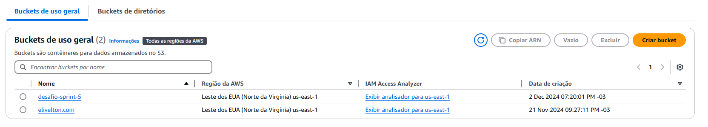
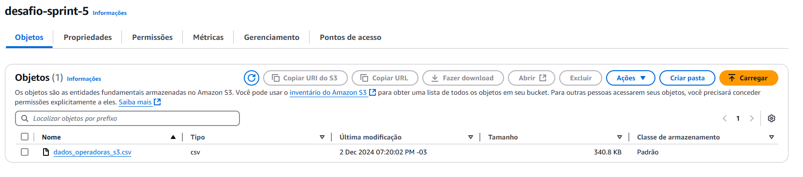
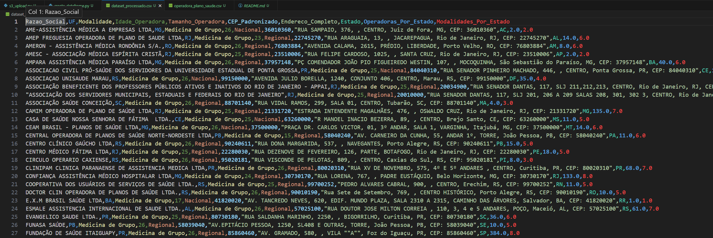
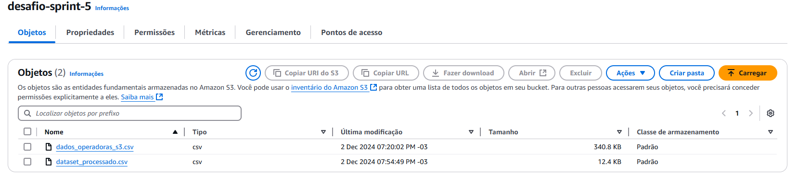

# Desafio Sprint 5 - Praticando conhecimentos de nuvem AWS

## Introdução

Este trabalho consistiu em processar um conjunto de dados sobre operadoras de saúde, obtido a partir de uma base pública do site do governo. O objetivo foi aplicar filtros e transformações, gerar novas colunas com informações relevantes e consolidar um novo dataset estruturado. Todo o processo foi conduzido localmente e em um ambiente de computação em nuvem utilizando um bucket no Amazon S3.

## Desenvolvimento

### Escolha do Conjunto de Dados

O conjunto de dados escolhido foi obtido do site oficial do governo e contém informações sobre operadoras de saúde, como razão social, estado (UF), modalidade, data de registro na ANS, entre outras. Após a escolha, o arquivo foi analisado localmente para identificar sua estrutura e os valores ausentes.

Evidência:
[Insira aqui um print do conjunto de dados bruto carregado localmente]

### Criação do Bucket e Upload do Arquivo para o S3

Foi desenvolvido um script em Python utilizando a biblioteca boto3 para:
 - Criar um bucket no Amazon S3.
 - Realizar o upload do arquivo escolhido para o bucket criado.

O script garante que o bucket seja configurado corretamente e que o arquivo seja armazenado de forma segura para processamento posterior.

```python
import boto3

# Configurações
BUCKET_NAME = "desafio-sprint-5"
INPUT_FILE = "operadora_plano_saude.csv"

def create_bucket(bucket_name):
    s3 = boto3.client('s3')
    try:
        print(f"Criando bucket '{bucket_name}'...")
        s3.create_bucket(Bucket=bucket_name)
        print(f"Bucket '{bucket_name}' criado com sucesso.")
    except Exception as e:
        print(f"Erro ao criar bucket: {e}")

def upload_file_to_s3(bucket_name, file_name, object_name):
    s3 = boto3.client('s3')
    try:
        print(f"Enviando '{file_name}' para o bucket '{bucket_name}'...")
        s3.upload_file(file_name, bucket_name, object_name)
        print(f"Arquivo '{file_name}' enviado com sucesso!")
    except Exception as e:
        print(f"Erro ao fazer upload: {e}")

# Criar bucket e realizar upload
create_bucket(BUCKET_NAME)
upload_file_to_s3(BUCKET_NAME, INPUT_FILE, INPUT_FILE)
```




### Processamento do Arquivo com um Script Python

Após o upload, um segundo script foi desenvolvido para acessar o arquivo no S3, realizar o processamento e aplicar filtros e transformações conforme solicitado. As etapas do processamento foram as seguintes:

#### Preenchimento de Valores Ausentes

Algumas colunas no dataset continham valores ausentes (NaN). Para evitar problemas nas análises, foram preenchidas com valores padrão:
- UF: Preenchido com "Desconhecido".
- Modalidade: Preenchido com "Indefinida".

####  Padronização de CEP para função de conversão

Foi convertido a coluna CEP para string e padronizando com 8 caracteres.

```python
dados['CEP_Padronizado'] = dados['CEP'].apply(lambda x: str(x).zfill(8))
 ```

#### Cálculo da Idade da Operadora para função de data

Foi calculada a idade de cada operadora com base na diferença entre o ano atual e o ano de registro na coluna Data_Registro_ANS.

```python
dados['Data_Registro_ANS'] = pd.to_datetime(dados['Data_Registro_ANS'], errors='coerce')
dados['Ano_Registro'] = dados['Data_Registro_ANS'].dt.year
dados['Idade_Operadora'] = datetime.now().year - dados['Ano_Registro']
```

#### Classificação do Tamanho da Operadora para função condicional

A coluna Regiao_de_Comercializacao foi usada para classificar as operadoras como:
- Local: Regiões ≤ 2.
- Regional: Regiões entre 3 e 5.
- Nacional: Regiões > 5.

```python
def categorizar_tamanho(regioes):
        if regioes <= 2:
            return "Local"
        elif 3 <= regioes <= 5:
            return "Regional"
        else:
            return "Nacional" 
```

#### Aplicação de Filtros com operadores lógicos

Foram selecionadas apenas as operadoras que atendem aos critérios:
- UF: Diferente de "SP".
- Modalidade: Igual a "Medicina de Grupo".
- Idade_Operadora: Maior ou igual a 15 anos.
- Tamanho_Operadora: Classificada como "Regional" ou "Nacional".

```python
filtro = (
        (dados['UF'] != 'SP') &
        (dados['Modalidade'] == 'Medicina de Grupo') &
        (dados['Idade_Operadora'] >= 15) &
        (dados['Tamanho_Operadora'].isin(['Regional', 'Nacional']))
    )
```

#### Agregações por Estado e Modalidade

Foi calculado:
- Operadoras por Estado: Número de CNPJs únicos por estado.
- Modalidades por Estado: Número de modalidades distintas por estado.

```python
estados = sorted(dados['UF'].unique())  # Garantir a ordem alfabética dos estados
    operadoras_por_estado = dados.groupby('UF')['CNPJ'].nunique().reindex(estados, fill_value=0).reset_index(name='Operadoras_Por_Estado')
    modalidades_por_estado = dados.groupby('UF')['Modalidade'].nunique().reindex(estados, fill_value=0).reset_index(name='Modalidades_Por_Estado')
```

#### Criação do Endereço Completo para função de string

Foi criada uma nova coluna Endereco_Completo concatenando as informações de logradouro, número, complemento, bairro, cidade, UF e CEP.

```python
dados['CEP_Padronizado'] = dados['CEP'].apply(lambda x: str(x).zfill(8))
    dados['Endereco_Completo'] = (
        dados['Logradouro'].fillna('') + ", " +
        dados['Numero'].fillna('') + ", " +
        dados['Complemento'].fillna('') + ", " +
        dados['Bairro'].fillna('') + ", " +
        dados['Cidade'].fillna('') + ", " +
        dados['UF'] + ", CEP: " +
        dados['CEP_Padronizado']
    )
```

### Criação do Novo Dataset

Após aplicar todas as transformações e agregações, um novo dataset foi gerado, contendo as seguintes colunas:

- Razao_Social
- UF
- Modalidade
- Idade_Operadora
- Tamanho_Operadora
- CEP_Padronizado
- Endereco_Completo
- Estado
- Operadoras_Por_Estado
- Modalidades_Por_Estado



### Upload do Novo Dataset para o S3

O arquivo final foi salvo localmente e enviado novamente para o S3.

```python
novo_dataframe.to_csv(PROCESSED_FILE, index=False, encoding="utf-8")
s3.upload_file(PROCESSED_FILE, BUCKET_NAME, S3_OBJECT_NAME)
```


### Conclusão

O trabalho consistiu em obter, processar e transformar um conjunto de dados público para gerar insights valiosos e organizados. O uso de filtros, cálculos e agregações permitiu estruturar o dataset em um formato mais informativo, adequado para análises futuras. Todo o processo foi realizado com sucesso e pode ser replicado para outros conjuntos de dados.

