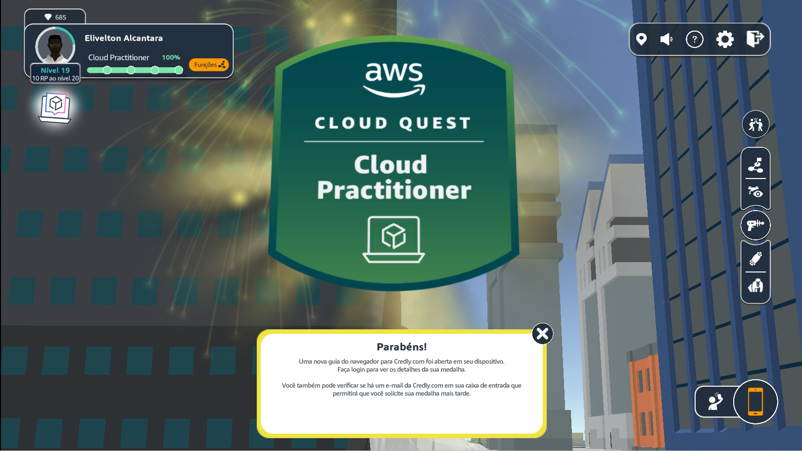

# Sprint 5: AWS Cloud Quest, Certificação e Elementos Essenciais da AWS

Nesta quinta sprint da trilha de aprendizado em Engenharia de Dados, explorei três cursos fundamentais sobre computação em nuvem, com foco em serviços AWS. Esses cursos fortaleceram minha compreensão da infraestrutura, segurança, preços e práticas recomendadas da AWS, além de me preparar para certificações e desafios do dia a dia na nuvem.

---

## AWS Cloud Quest - Cloud Practitioner

### Descrição Geral
Este curso inovador combinou aprendizado gamificado com prática prática. Por meio de desafios interativos e criação de soluções reais, adquiri habilidades fundamentais nos serviços da AWS, como Amazon S3, EC2, DynamoDB, entre outros. A experiência foi única: criei meu avatar, interagi com clientes virtuais e resolvi problemas do mundo real, tudo enquanto desenvolvia uma cidade virtual!

### Conteúdo Abrangido
- **Fundamentos da Computação em Nuvem**: Introdução aos conceitos básicos de nuvem.
- **Serviços de Armazenamento e Computação**: Uso prático do Amazon S3, EC2 e VPC.
- **Banco de Dados**: Introdução ao Amazon RDS e DynamoDB.
- **Segurança e Escalabilidade**: Trabalhei com IAM, Auto Scaling e Elastic Load Balancer.
- **Conceitos Econômicos**: Utilização da calculadora de preços da AWS.
- **Laboratórios Práticos**: Realizei tarefas como conectar VPCs, criar sistemas de arquivos e configurar aplicativos web de alta disponibilidade.

### Resultado
Concluí todos os desafios, adquiri conhecimento prático e conquistei um badge oficial da AWS, que valida minha proficiência no uso dos serviços básicos da AWS.

[Badge Cloud Quest](https://www.credly.com/badges/a0408883-6cbb-49e7-b9ca-fd645cdd2aae)

---

## Elementos Essenciais do AWS Cloud Practitioner

### Descrição Geral
Este curso introdutório forneceu uma visão abrangente sobre os conceitos e serviços da AWS. Por meio de apresentações, demonstrações práticas e quizzes, adquiri uma base sólida em nuvem, segurança, arquitetura e estratégias de migração.

### Conteúdo Abrangido
- **Infraestrutura Global da AWS**: Zonas de disponibilidade, locais de borda e provisionamento de serviços.
- **Serviços Principais**: Introdução ao Amazon EC2, S3, DynamoDB e RDS.
- **Segurança**: Autenticação multifator, IAM e AWS Organizations.
- **Monitoramento e Análise**: Uso do CloudWatch, CloudTrail e Trusted Advisor.
- **Modelos de Preços**: Exploração do AWS Budgets, Cost Explorer e calculadora de preços.
- **Migração e Inovação**: AWS CAF e estratégias para adoção da nuvem.

### Resultado
A conclusão do curso consolidou meus conhecimentos básicos da AWS, preparando-me ainda mais para a certificação e para lidar com desafios no ambiente de nuvem.

---

## Curso-Padrão de Preparação para o Exame AWS Certified Cloud Practitioner

### Descrição Geral
Este curso preparatório abordou todos os tópicos necessários para o exame AWS Certified Cloud Practitioner (CLF-C02). Através de vídeos, laboratórios e questões no estilo do exame, refinei meu conhecimento sobre a AWS e pratiquei conceitos essenciais para me certificar.

### Conteúdo Abrangido
- **Conceitos de Nuvem**: Benefícios, estratégias de migração e modelos econômicos da AWS.
- **Segurança e Conformidade**: Modelo de responsabilidade compartilhada, IAM e governança.
- **Serviços Principais da AWS**: Computação, armazenamento, redes e bancos de dados.
- **Cobrança e Preços**: Modelos de preços, gerenciamento de custos e ferramentas como o AWS Budgets.
- **Simulado Oficial**: Resolvi questões no estilo do exame para avaliar minha preparação.

### Objetivo
O curso me permitiu identificar lacunas no conhecimento, reforçar conceitos e me preparar com confiança para a certificação AWS Certified Cloud Practitioner.

## Evidências

[Evidências](./Evidencias/)

---

## Exercícios

[Exercícios](./Exercicios/) 

[Site Hospedado](http://elivelton.com.s3-website-us-east-1.amazonaws.com)

## Certificados

[Certificados](./Certificados/)

---

Com esta sprint, fortaleci minha base em computação em nuvem e AWS, avançando com confiança no caminho para me tornar um especialista em Engenharia de Dados. Acompanhe o repositório para atualizações e novas conquistas!
