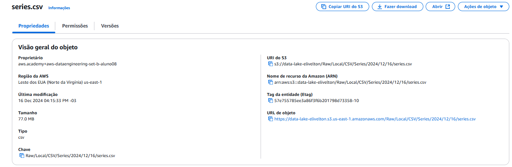
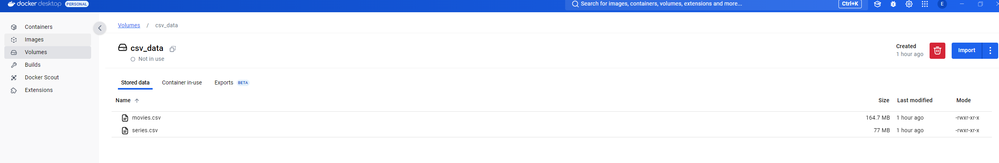
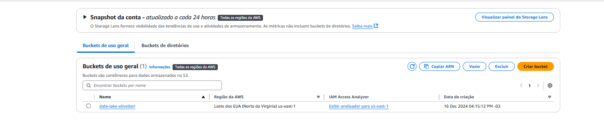

# Projeto Data Lake para Filmes e Séries

## **Descrição Geral do Projeto**
Este projeto consiste na criação de um Data Lake para o armazenamento e análise de dados de filmes e séries, com foco nos gêneros **Drama** e **Romance**. O objetivo é implementar as etapas de ingestão, armazenamento, processamento e consumo dos dados, utilizando tecnologias como Docker e AWS S3.

O projeto é dividido em 5 entregas. Esta documentação cobre o processo realizado até a Entrega 1.

---

## **Objetivos do Projeto**
1. Criar um Bucket utilizando AWS S3.
2. Criar ingestões de dados no formato CSV.
3. Processar e armazenar os dados em camadas organizadas.
4. Realizar análises específicas baseadas nos gêneros **Drama** e **Romance**.

---

## **Questões a Responder com os Dados**

1. **Popularidade e Sucesso:**
   - Quais são os filmes e séries de Drama e Romance mais populares com base em avaliações e bilheteria?
   - Existe uma relação entre orçamento e popularidade?

2. **Tendências ao Longo do Tempo:**
   - Como a produção de filmes e séries de Drama e Romance evoluiu ao longo das décadas?
   - Quais os anos mais marcantes para esses gêneros?

3. **Distribuição Geográfica:**
   - Quais países mais produzem conteúdo de Drama e Romance?
   - Existe uma diferença na popularidade de acordo com a nacionalidade das produções?

4. **Análises Comparativas:**
   - Quais diretores e atores são mais associados a produções de Drama e Romance?
   - Filmes e séries de Drama e Romance têm avaliações significativamente diferentes de outros gêneros?

5. **Perfil do Público:**
   - Qual o perfil médio de avaliação para produções de Drama e Romance?
   - Esses gêneros têm maior engajamento em plataformas específicas?

---

## **Processo de Desenvolvimento**

### **1. Configuração do Ambiente**
- **Ferramentas Utilizadas:**
  - Python 3.9
  - Docker
  - AWS CLI
  - Bibliotecas: `boto3`, `pandas`

- **Configuração AWS CLI:**
  - Executado `aws configure` para salvar as credenciais no arquivo `~/.aws/credentials`.
  - Verificado o acesso às credenciais com:
    ```bash
    aws s3 ls
    ```

---

### **2. Desenvolvimento do Código**

#### **Arquivo `upload.py`**
1. **Função para Criar o Bucket S3:**
   - Implementada a função `create_bucket` para criar um bucket no S3 com ou sem especificação de região.

2. **Função para Upload de Arquivos ao S3:**
   - `upload_to_s3`:
     - Processa a data de upload.
     - Define a estrutura de pastas no S3.
     - Envia os arquivos para o bucket na estrutura:
       ```
       Raw/Local/CSV/<Tipo de Dado>/<Ano>/<Mês>/<Dia>/<Arquivo>
       ```

3. **Estrutura do Código:**
   - Criar bucket caso ele não exista.
   - Enviar os arquivos `movies.csv` e `series.csv` ao S3 utilizando o formato especificado.

#### **Exemplo de Estrutura de Upload no S3:**
```bash
s3://data-lake-do-elivelton/Raw/Local/CSV/Movies/2024/12/10/movies.csv
s3://data-lake-do-elivelton/Raw/Local/CSV/Series/2024/12/10/series.csv
```

Arquivo series dentro do Bucket com a estrutura correta



---

### **3. Configuração do Docker**

#### **Dockerfile**
Arquivo `Dockerfile` criado para construir o ambiente de execução:

```dockerfile
# Imagem base
FROM python:3.9

# Diretório de trabalho no container
WORKDIR /app

# Copiar os arquivos para o container
COPY . /app

# Instalar as dependências necessárias
RUN pip install boto3 pandas

# Comando padrão ao iniciar o container
CMD ["python", "analise.py"]
```

#### **Criação da Imagem Docker**
Construída a imagem com o comando:
```bash
docker build -t aws-s3-uploader .
```

---

### **4. Configuração do Volume no Docker**
1. Criado o volume Docker para armazenar os arquivos CSV:
   ```bash
   docker volume create csv_data
   ```

2. Copiados os arquivos `movies.csv` e `series.csv` para o volume:
   ```bash
   docker run --rm -v csv_data:/app/data -v $(pwd):/host busybox cp /host/movies.csv /app/data/movies.csv
   docker run --rm -v csv_data:/app/data -v $(pwd):/host busybox cp /host/series.csv /app/data/series.csv
   ```

Arquivos de dentro do volume



---

### **5. Execução do Container**
O container foi executado montando o volume `csv_data` e as credenciais AWS:

```bash
docker run --rm -v csv_data:/app/data -v $HOME/.aws:/root/.aws aws-s3-uploader
```
Após a execução do container bucket foi criado



---

## **Conclusão**
Este documento registra o processo inicial do projeto Data Lake para Filmes e Séries, cobrindo desde a configuração do ambiente até a entrega dos arquivos CSV no S3.