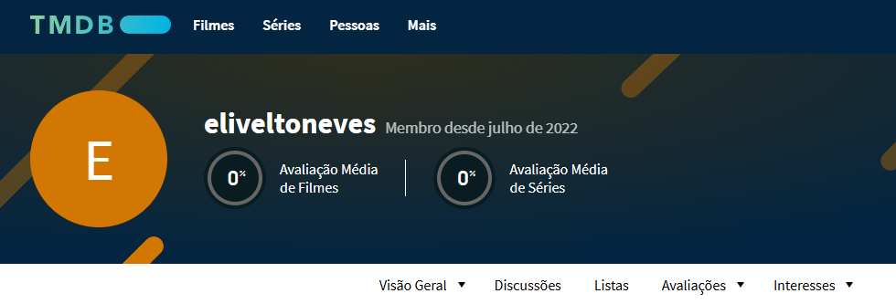
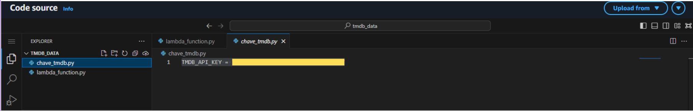
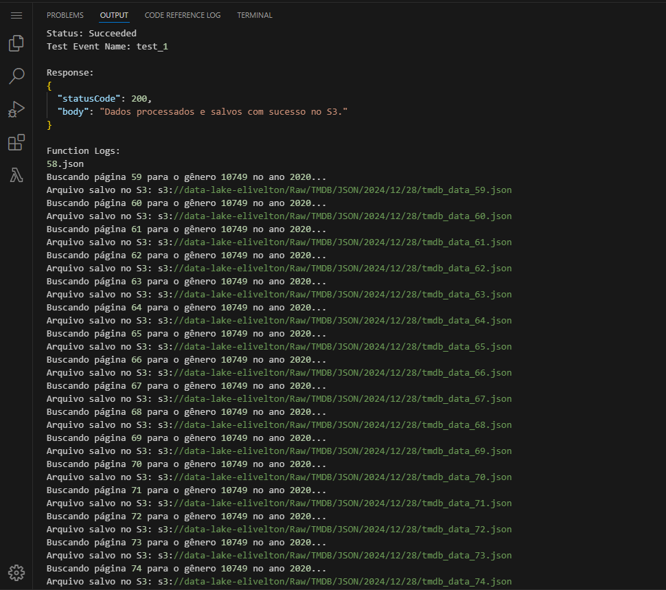
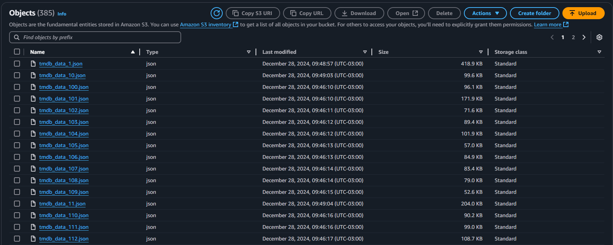
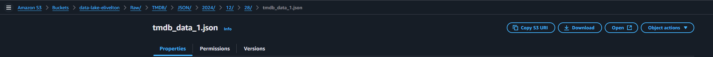
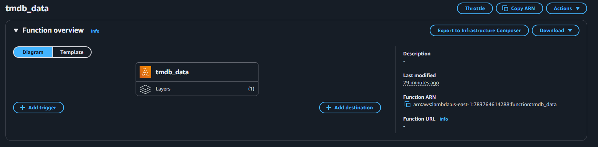
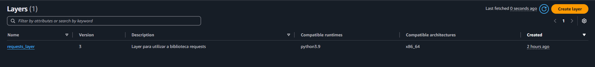
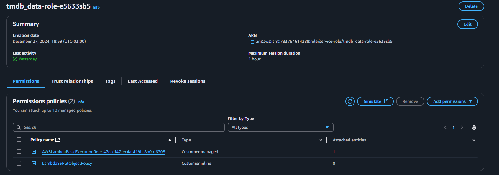

# Complementação dos Dados com API TMDB

## **Descrição Geral do Problema**
A segunda etapa do desafio consistia em complementar os dados de filmes e séries carregados na etapa anterior, provenientes de arquivos CSV, com informações adicionais obtidas por meio da API do TMDB. Essas informações adicionais visavam enriquecer a base de dados para permitir análises mais aprofundadas e detalhadas.

O principal desafio era:
- Realizar requisições à API do TMDB para buscar dados complementares.
- Selecionar dados específicos para análise no ano de 2020, focando nos gêneros Drama e Romance que serão o objeto da minha análise.
- Persistir os dados no bucket S3 em uma estrutura padronizada:
  ```
  S3://data-lake-elivelton/Raw/TMDB/JSON/<ano>/<mês>/<dia>/<arquivo>
  ```
- Garantir que os arquivos não ultrapassassem 10 MB e contivessem no máximo 100 registros cada.

## **Como Resolvi o Problema**

### **1. Planejamento Inicial**
1. Decidi buscar os dados para os gêneros Drama (`18`) e Romance (`10749`), separadamente.
2. Filtrei as informações apenas para o ano de 2020, limitando os resultados a filmes lançados nesse período.
3. Determinei os campos relevantes para análise, como id,  popularidade, orçamento, receita, países de produção e provedores de exibição.

### **2. Desenvolvimento da Solução**

#### **2.1 Configuração da API TMDB**
1. **Cadastro no TMDB:**
   - Criei uma conta no TMDB e gerei uma chave de API.

   

   - Configurei a chave como uma variável de ambiente no AWS Lambda para garantir segurança.

   

2. **Requisições à API:**
   - Desenvolvi um script Python que utiliza a biblioteca `requests` para consumir a API.
   
   ```python
    import os
    import requests
    import json
    from datetime import datetime
    import boto3

    # Configurações
    from chave_tmdb import TMDB_API_KEY  # Chave da API de um arquivo separado
    TMDB_BASE_URL = "https://api.themoviedb.org/3"
    BUCKET_NAME = "data-lake-elivelton"

    # Inicializar o cliente S3
    s3_client = boto3.client('s3')

    def fetch_tmdb_data(endpoint, params):
        """Faz uma requisição para a API do TMDB."""
        params['api_key'] = TMDB_API_KEY
        response = requests.get(f"{TMDB_BASE_URL}/{endpoint}", params=params)
        response.raise_for_status()
        return response.json()

    def save_to_s3(data, file_name):
        """Salva os dados em um arquivo JSON no S3."""
        today = datetime.now()
        date_path = today.strftime("%Y/%m/%d")

        # Caminho no S3
        s3_path = f"Raw/TMDB/JSON/{date_path}/{file_name}"

        # Salvar o arquivo diretamente no S3
        s3_client.put_object(
            Bucket=BUCKET_NAME,
            Key=s3_path,
            Body=json.dumps(data, ensure_ascii=False),
            ContentType='application/json'
        )
        print(f"Arquivo salvo no S3: s3://{BUCKET_NAME}/{s3_path}")

    def fetch_and_save_movies_by_genre(year, genre_id):
        """Busca filmes por gênero e ano de lançamento e salva no S3."""
        page = 1
        part = 1

        while True:
            print(f"Buscando página {page} para o gênero {genre_id} no ano {year}...")
            data = fetch_tmdb_data("discover/movie", {
                "language": "en-US",
                "page": page,
                "with_genres": genre_id,
                "primary_release_date.gte": f"{year}-01-01",
                "primary_release_date.lte": f"{year}-12-31"
            })

            results = data.get("results", [])

            if not results:
                break

            # Filtrar os campos necessários
            filtered_results = []
            for movie in results:
                movie_id = movie.get("id")

                # Obter informações detalhadas do filme
                movie_details = fetch_tmdb_data(f"movie/{movie_id}", {"language": "en-US"})

                filtered_results.append({
                    "id": movie_details.get("id"),
                    "popularity": movie_details.get("popularity"),
                    "budget": movie_details.get("budget"),
                    "revenue": movie_details.get("revenue"),
                    "production_companies": movie_details.get("production_companies"),
                    "production_countries": movie_details.get("production_countries"),
                    "reviews": movie_details.get("vote_count"),
                    "watch/providers": fetch_tmdb_data(f"movie/{movie_id}/watch/providers", {"language": "en-US"}).get("results")
                })

            # Agrupar em arquivos de até 100 registros
            for i in range(0, len(filtered_results), 100):
                chunk = filtered_results[i:i+100]
                file_name = f"tmdb_data_{part}.json"
                save_to_s3(chunk, file_name)
                part += 1

            total_pages = data.get("total_pages", 1)
            if page >= total_pages:
                break

            page += 1

    def lambda_handler(event, context):
        """Função Lambda principal."""
        year = 2020

        # Processar os gêneros separadamente
        genres = [18, 10749]  # Drama (18) e Romance (10749)

        for genre_id in genres:
            fetch_and_save_movies_by_genre(year, genre_id)

        return {"statusCode": 200, "body": "Dados processados e salvos com sucesso no S3."}

   ```

   - Resultado da função Lambda 

   


#### **2.2 Processamento e Armazenamento no S3**
1. **Filtragem dos Dados:**
   - Para cada filme, busquei detalhes adicionais (ex.: orçamento, receita, países de produção, críticas e avaliações e plataformas disponíveis).
   - Agrupei os dados em arquivos JSON com, no máximo, 100 registros cada.

   


2. **Estrutura no S3:**
   - Os arquivos JSON foram enviados diretamente para o bucket S3 com o seguinte padrão:
     ```
     S3://data-lake-elivelton/Raw/TMDB/JSON/2020/12/28/tmdb_data_1.json
     ```
     

   - Para isso, utilizei a biblioteca `boto3` no script Python.    

#### **2.3 Automação no AWS Lambda**
1. **Implementação no Lambda:**
   - Ajustei o script para ser executado como uma função Lambda.
   
   

2. **Criação de Layers:**
   - Adicionei a biblioteca `requests` via Layer no AWS Lambda para garantir sua disponibilidade.

   

3. **Permissões:**
   - Atualizei a role associada à função Lambda para incluir permissões de gravação no S3.

   

---

## **Dificuldades Encontradas e Como Resolvi**

### **1. Importação da Biblioteca `requests`**
- **Problema:** A biblioteca `requests` não estava disponível no ambiente do AWS Lambda.
- **Solução:** Criei um Layer personalizado contendo a biblioteca e o associei à função Lambda.

### **2. Erro de Permissões no S3**
- **Problema:** A função Lambda não tinha permissão para gravar os arquivos no bucket S3.
- **Solução:** Atualizei a role da função Lambda para incluir a ação `s3:PutObject` no bucket com a estrutura especificada.

### **3. Segurança da Chave da API**
- **Problema:** A chave da API era um dado sensível e não podia ser exposta no código.
- **Solução:** Configurei a chave como uma variável de ambiente no AWS Lambda.

---

## **Resultados Obtidos**
1. **Persistência dos Dados no S3:**
   - Os dados foram armazenados no S3 com sucesso, seguindo a estrutura:
     ```
     S3://data-lake-elivelton/Raw/TMDB/JSON/2020/12/28/tmdb_data_1.json
     ```

2. **Organização e Padronização:**
   - Cada arquivo JSON contém no máximo 100 registros, garantindo eficiência no armazenamento e processamento.


3. **Automação e Segurança:**
   - A função Lambda está configurada para executar automaticamente no horário especificado, utilizando boas práticas de segurança para dados sensíveis.

---

## **Conclusão**
Este processo permitiu complementar os dados dos arquivos CSV com informações adicionais obtidas da API TMDB, garantindo que os dados fossem organizados e armazenados de forma segura e padronizada no S3. As dificuldades encontradas foram resolvidas com soluções práticas e alinhadas às melhores práticas de desenvolvimento na nuvem.
