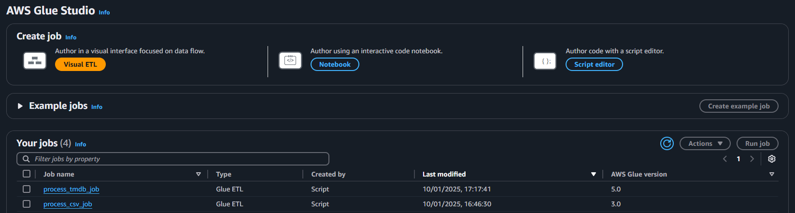
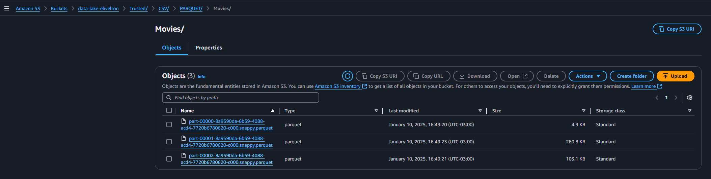
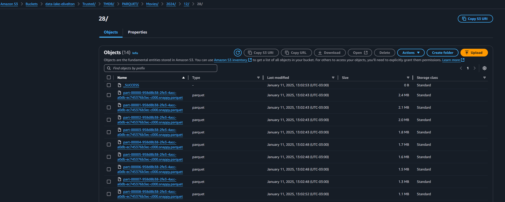
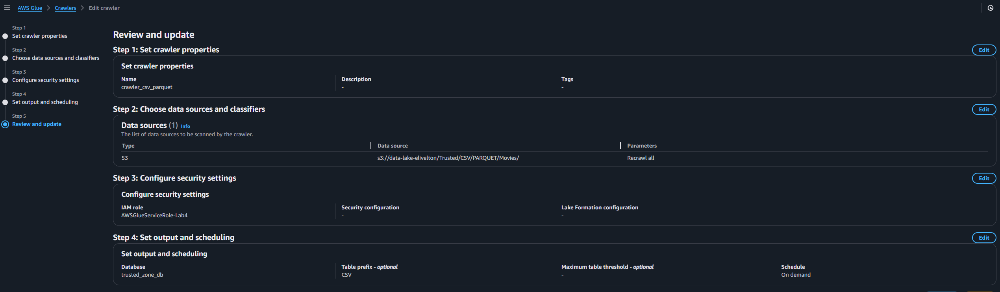
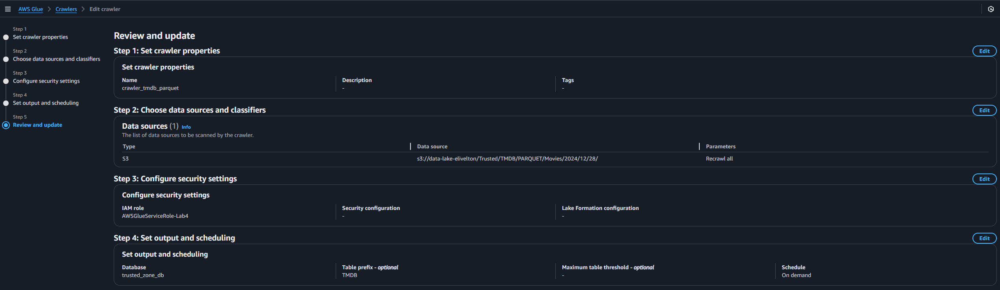
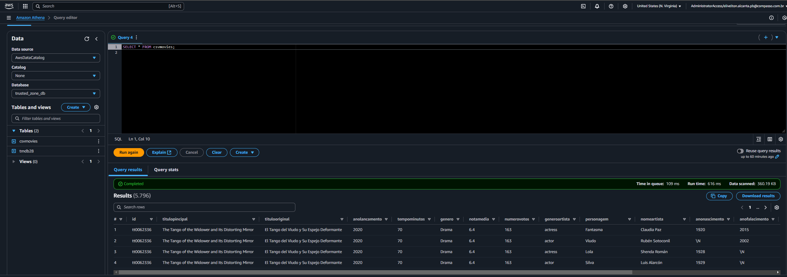
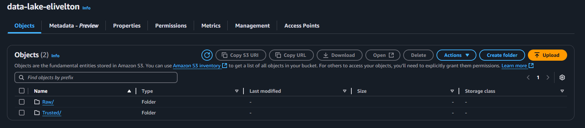

# Documentação do Processo de Integração e Transformação de Dados com AWS Glue e Athena

## Descrição Geral do Problema

O objetivo deste projeto foi implementar um pipeline para transformar, filtrar e catalogar dados armazenados em diferentes formatos no Amazon S3, tornando-os acessíveis para análise no AWS Athena. Os dados consistem em arquivos CSV contendo informações sobre filmes e arquivos JSON com dados adicionais da API TMDB.

## Problema a Ser Resolvido

Os dados brutos armazenados na camada Raw apresentavam formatos variados (CSV e JSON), sem particionamento ou padronização. Isso dificultava a análise eficiente, já que os dados precisavam ser convertidos para o formato Parquet e catalogados no Glue Data Catalog para facilitar consultas no Athena.

## Solução Implementada

### 1. Criação dos Jobs no AWS Glue

Dois jobs Glue foram criados:



#### **Job: `process_csv_job`**
Este job foi responsável por:
- Ler os arquivos CSV brutos localizados no bucket S3 no caminho:
  `s3://data-lake-elivelton/Raw/Local/CSV/Movies/2024/12/16/movies.csv`.
- Filtrar os dados conforme os critérios:
  - Apenas filmes dos gêneros “Drama” e “Romance”.
  - Apenas filmes lançados em 2020.
- Converter os dados filtrados para o formato Parquet.
- Salvar os dados transformados no bucket S3 no caminho:
  `s3://data-lake-elivelton/Trusted/CSV/PARQUET/Movies/`.

O script usado para este job incluía:
- Uso do Spark para manipulação dos dados.
- Configurações dinâmicas para aceitar os caminhos de entrada e saída como parâmetros.
- Criação automática de pastas no bucket S3, caso não existissem.

```python
import sys
import os
from pyspark.context import SparkContext
from awsglue.context import GlueContext
from awsglue.job import Job
from awsglue.transforms import *
from awsglue.utils import getResolvedOptions
from awsglue.dynamicframe import DynamicFrame
import boto3

# Pegar os argumentos do job parameters
args = getResolvedOptions(sys.argv, ['JOB_NAME', 'input_path', 'output_path'])

input_path = args['input_path']
output_path = args['output_path']

# Configuração do Glue Context
sc = SparkContext()
glueContext = GlueContext(sc)
spark = glueContext.spark_session
job = Job(glueContext)
job.init(args['JOB_NAME'], args)

# Criação de diretórios no bucket, se necessário
s3 = boto3.client('s3')

# Extrair bucket e prefix do output_path
bucket_name = output_path.split('/')[2]
prefix = '/'.join(output_path.split('/')[3:]) + "CSV/PARQUET/Movies/"

# Criar diretório no S3, se não existir
if not s3.list_objects_v2(Bucket=bucket_name, Prefix=prefix).get('Contents'):
    s3.put_object(Bucket=bucket_name, Key=(prefix if prefix.endswith('/') else prefix + '/'))

# Carregar os dados da camada raw
datasource0 = glueContext.create_dynamic_frame.from_options(
    connection_type="s3",
    connection_options={"paths": [input_path]},
    format="csv",
    format_options={"withHeader": True, "separator": "|"}
)

# Converter DynamicFrame para DataFrame para realizar a filtragem
df = datasource0.toDF()

# Filtrar apenas os filmes do gênero "Drama" ou "Romance" e do ano de 2020
df_filtrado = df.filter(
    (df['genero'].isin('Drama', 'Romance')) & (df['anoLancamento'] == 2020)
)

# Converter de volta para DynamicFrame para salvar no Glue Data Catalog
dynamic_frame_filtrado = DynamicFrame.fromDF(df_filtrado, glueContext, "dynamic_frame_filtrado")

# Gravar os dados na camada trusted
glueContext.write_dynamic_frame.from_options(
    frame=dynamic_frame_filtrado,
    connection_type="s3",
    connection_options={"path": f"s3://{bucket_name}/{prefix}"},
    format="parquet"
)

# Finalizar o job
job.commit()
```

#### **Job: `process_tmdb_job`**

Este job tratou os dados JSON provenientes da API TMDB. Os passos foram:

- Leitura dos Dados: Os dados JSON foram lidos a partir da camada Raw.

- Obtenção da Data de Ingestão: A data de modificação mais recente dos arquivos na camada Raw foi utilizada como referência de ingestão.

- Criação do Caminho de Saída: O caminho de saída foi gerado automaticamente no formato Trusted/TMDB/PARQUET/Movies/YYYY/MM/DD, com base na data de ingestão.

 - Conversão para Parquet: Os dados foram convertidos para o formato Parquet, otimizando o armazenamento e a performance em consultas.

 - Salvamento: Os dados transformados foram salvos no bucket na camada Trusted com o particionamento especificado.

 ```python
 import sys
from pyspark.context import SparkContext
from pyspark.sql import SparkSession
from awsglue.context import GlueContext
from awsglue.transforms import *
from awsglue.utils import getResolvedOptions
from pyspark.sql.functions import date_format, col
from datetime import datetime

# Contexto do Glue
glueContext = GlueContext(SparkContext.getOrCreate())
spark = glueContext.spark_session

# Obter os parâmetros passados no job
args = getResolvedOptions(sys.argv, ["input_path", "output_path"])
input_path = args["input_path"]
output_path = args["output_path"]

# Ler os dados JSON da camada Raw
df = spark.read.format("json").load(input_path)

# Obter a data de modificação mais recente (simula a data de ingestão)
file_metadata = spark.sparkContext._jvm.org.apache.hadoop.fs.Path(input_path)
fs = spark.sparkContext._jvm.org.apache.hadoop.fs.FileSystem.get(file_metadata.toUri(), spark._jsc.hadoopConfiguration())

file_statuses = fs.listStatus(file_metadata)
ingestion_date = max([status.getModificationTime() for status in file_statuses])

# Converter timestamp para o formato YYYY/MM/DD
partition_date = datetime.fromtimestamp(ingestion_date / 1000).strftime("%Y/%m/%d")

# Criar o caminho de saída no formato especificado
output_path_partitioned = f"{output_path}TMDB/PARQUET/Movies/{partition_date}"

# Salvar na camada Trusted em formato Parquet
df.write.mode("overwrite").parquet(output_path_partitioned)

 ```

### 2. Conversão para Parquet
O formato Parquet foi escolhido para os dados transformados devido às seguintes vantagens:
- Compressão eficiente.
- Melhor desempenho em consultas no AWS Athena.




### 3. Criação de Crawlers no AWS Glue

Dois crawlers foram configurados para catalogar os dados transformados:

- **Crawler 1:** Responsável por catalogar os dados do arquivo CSV processado e armazenado como Parquet no caminho:
  `s3://data-lake-elivelton/Trusted/CSV/PARQUET/Movies/`.

  

- **Crawler 2:** Responsável por catalogar os dados transformados do TMDB em formato Parquet.
    `s3://data-lake-elivelton/Trusted/TMDB/PARQUET/Movies/2024/12/28/`

     

Esses crawlers foram configurados para executar periodicamente e atualizar o Glue Data Catalog, tornando os dados acessíveis para consultas no Athena.

### 4. Consultas no AWS Athena
Com os dados catalogados, foi possível visualizar as tabelas pelo  Athena para explorar e analisar os filmes conforme o escopo desejado. A nova estrutura de dados em Parquet reduziu significativamente os tempos de consulta.



## Desafios Encontrados e Solução

1. **Configuração do separador no CSV:**
   - O arquivo CSV usava o separador `|`. A solução foi configurar explicitamente o separador no script do Glue.

2. **Filtragem dinâmica dos dados:**
   - A filtragem exigiu a combinação de condições nos campos “genero” e “anoLancamento”.
   - Spark foi usado para manipular os dados de forma eficiente.

3. **Estruturação de pastas no S3:**
   - O padrão de armazenamento final não existia. Foi implementada a criação automática de pastas no S3 via boto3.

   

4. **Performance nas consultas:**
   - Antes da conversão para Parquet, as consultas no Athena eram lentas. Após a transformação, o tempo de execução das queries foi reduzido drasticamente.

## Resultados Obtidos
- Dados transformados e armazenados em formato otimizado no S3.
- Estrutura organizada para consultas rápidas no Athena.
- Pipeline automatizado e escalável, com tarefas programadas via Glue Jobs e Crawlers.
- Redução no tempo de processamento e aumento na eficiência das consultas.

## Conclusão
O processo implementado atendeu aos objetivos do projeto, otimizando o armazenamento e o acesso aos dados. As soluções aplicadas garantem escalabilidade e manutenção simples, permitindo a continuação do trabalho com grandes volumes de dados.

Caso seja necessário ampliar o pipeline, o mesmo pode ser ajustado para novos requisitos sem comprometer a infraestrutura atual.

