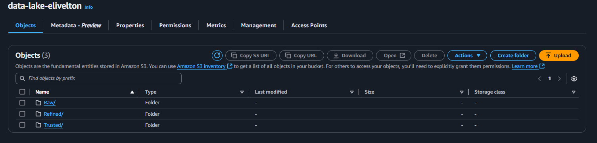
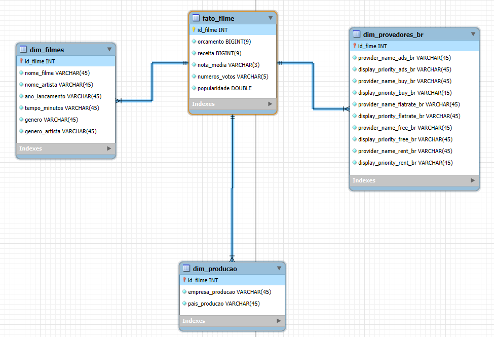
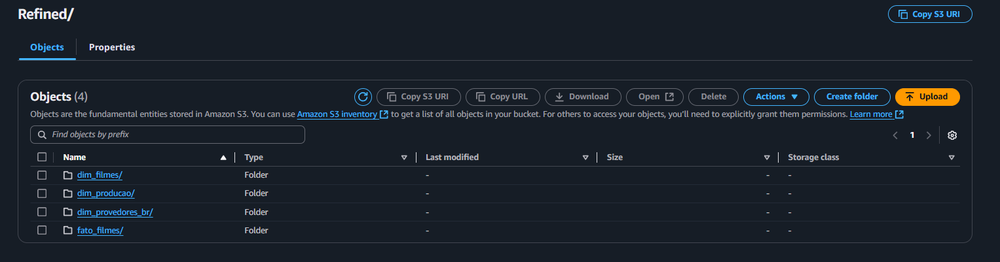
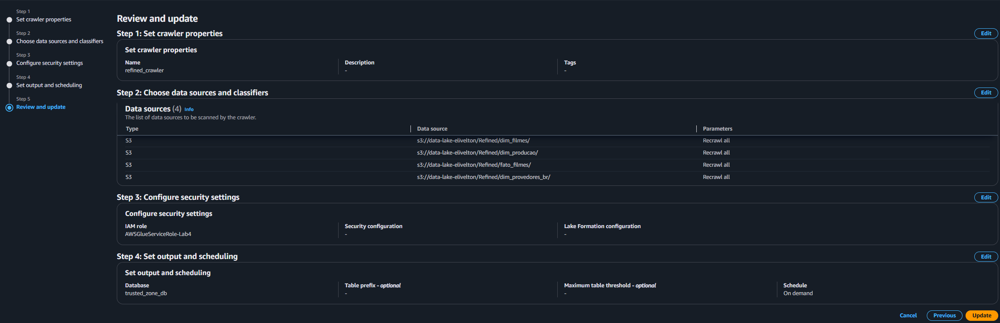

# Documentação do DataLake e Modelo Dimensional

## Visão Geral
Este documento descreve todo o processo de criação e refinamento dos dados para um DataLake utilizando serviços da AWS, incluindo a criação de um modelo dimensional. O objetivo foi permitir consultas analíticas otimizadas via Amazon Athena e fornecer insights valiosos sobre filmes a partir de dados brutos.

## Estrutura do Projeto

### 1. **Camadas do DataLake**
O DataLake foi dividido em três camadas principais:
- **Raw**: Contém os dados brutos, sem processamento.
- **Trusted**: Dados validados e processados, armazenados no formato Parquet.
- **Refined**: Dados refinados e organizados em um modelo dimensional.



### 2. **Modelo Dimensional**
O modelo dimensional foi criado para facilitar análises e consultas de BI. Ele segue o esquema estrela (**star schema**), com uma tabela fato central e tabelas dimensão conectadas.



#### **Tabela Fato: fato_filmes**
Contém os dados quantitativos relacionados aos filmes, como métricas financeiras e de popularidade:
- **id_filme** (chave primária)
- **orcamento**
- **receita**
- **nota_media**
- **numero_votos**
- **popularidade**

#### **Tabelas Dimensão**
1. **dim_filmes**
   - **id_filme** (chave primária)
   - **nome_filme**
   - **nome_artista**
   - **ano_lancamento**
   - **tempo_minutos**
   - **genero**
   - **genero_artista**

2. **dim_producao**
   - **id_filme** (chave estrangeira)
   - **empresa_producao**
   - **pais_producao**

3. **dim_provedores_br**
   - **id_filme** (chave estrangeira)
   - **provider_name_ads_br**
   - **provider_name_buy_br**
   - **provider_name_flatrate_br**
   - **provider_name_free_br**
   - **provider_name_rent_br**

## Refinamento dos Dados

### **Script Glue**
O script Glue foi projetado para realizar as seguintes operações:

1. **Unir dados brutos**:
   - Dados da camada `trusted/csv` e `trusted/tmdb` foram combinados pela chave `id` (no CSV) e `imdb_id` (no TMDB).

2. **Transformações principais**:
   - **Explosão de Arrays**:
     - Extração de nomes de produtoras da coluna `production_companies`.
     - Extração de países de produção da coluna `production_countries`.
     - Extração de provedores específicos do Brasil da coluna `watch/providers`.
   - **Preenchimento de valores ausentes**:
     - Valores vazios foram preenchidos com "Sem Informações" para evitar inconsistências.
   - **Renomeação de colunas** para nomes mais claros e intuitivos.

3. **Criação das tabelas refinadas**:
   - **Tabela fato_filmes**:
     Inclui métricas principais (orcamento, receita, popularidade, etc.).
   - **Tabela dim_filmes**:
     Contém atributos descritivos fixos dos filmes (nome, gênero, etc.).
   - **Tabela dim_producao**:
     Inclui informações sobre empresas e países de produção.
   - **Tabela dim_provedores_br**:
     Inclui informações específicas sobre provedores disponíveis no Brasil.

 

### **Código do Script Glue**
```python
import sys
from pyspark.context import SparkContext
from pyspark.sql import SparkSession
from awsglue.context import GlueContext
from awsglue.utils import getResolvedOptions
from awsglue.job import Job
from pyspark.sql.functions import col, explode_outer, lit, coalesce

# Configuração do Glue e Spark
glueContext = GlueContext(SparkContext.getOrCreate())
spark = glueContext.spark_session

# Obter argumentos de entrada
args = getResolvedOptions(sys.argv, ["JOB_NAME", "trusted_csv_path", "trusted_tmdb_path", "refined_path"])
trusted_csv_path = args["trusted_csv_path"]
trusted_tmdb_path = args["trusted_tmdb_path"]
refined_path = args["refined_path"]

# Inicializar o Job do Glue
job = Job(glueContext)
job.init(args["JOB_NAME"], args)

# Carregar dados Trusted
df_csv = spark.read.parquet(trusted_csv_path)
df_tmdb = spark.read.parquet(trusted_tmdb_path)

# Unir os dados
df_combined = df_csv.join(df_tmdb, df_csv["id"] == df_tmdb["imdb_id"], "inner")

# Extrair dados de provedores apenas do Brasil (BR)
if "watch/providers" in df_combined.columns:
    # Acessar diretamente a região do Brasil (BR)
    df_combined = df_combined.withColumn("br_providers", col("watch/providers.BR"))
    
    # Explodir as categorias dentro da região BR
    for category in ["ads", "buy", "flatrate", "free", "rent"]:
        df_combined = df_combined.withColumn(
            f"watch_{category}_br",
            explode_outer(col(f"br_providers.{category}"))  # Explodir a categoria específica
        )
        df_combined = df_combined.withColumn(
            f"provider_name_{category}_br",
            coalesce(col(f"watch_{category}_br.provider_name"), lit("Sem Informações"))
        ).withColumn(
            f"display_priority_{category}_br",
            coalesce(col(f"watch_{category}_br.display_priority"), lit(-1))
        ).drop(f"watch_{category}_br")

# Explodir e renomear production_companies
if "production_companies" in df_combined.columns:
    df_combined = df_combined.withColumn(
        "production_companies_exploded",
        explode_outer(col("production_companies"))
    )
    df_combined = df_combined.withColumn(
        "empresa_producao", coalesce(col("production_companies_exploded.name"), lit("Sem Informações"))
    ).drop("production_companies", "production_companies_exploded")

# Explodir e renomear production_countries
if "production_countries" in df_combined.columns:
    df_combined = df_combined.withColumn(
        "production_countries_exploded",
        explode_outer(col("production_countries"))
    )
    df_combined = df_combined.withColumn(
        "pais_producao", coalesce(col("production_countries_exploded.name"), lit("Sem Informações"))
    ).drop("production_countries", "production_countries_exploded")

# Limpeza e transformação de colunas
df_transformed = (
    df_combined
    .fillna("Sem Informações", subset=["empresa_producao", "pais_producao"])
    .withColumnRenamed("id", "id_filme")
    .withColumnRenamed("tituloPincipal", "nome_filme")
    .withColumnRenamed("anoLancamento", "ano_lancamento")
    .withColumnRenamed("tempoMinutos", "tempo_minutos")
    .withColumnRenamed("gênero", "genero")
    .withColumnRenamed("notaMedia", "nota_media")
    .withColumnRenamed("numeroVotos", "numero_votos")
    .withColumnRenamed("generoArtista", "genero_artista")
    .withColumnRenamed("nomeArtista", "nome_artista")
    .withColumnRenamed("Budget", "orcamento")
    .withColumnRenamed("popularity", "popularidade")
    .withColumnRenamed("revenue", "receita")
    .drop("tituloOriginal", "anoNascimento", "anoFalecimento", "profissao", "titulosMaisConhecidos", "watch/providers")
    .dropDuplicates(["id_filme"])
)

# Salvar os dados refinados na camada Refined
refined_path_partitioned = f"{refined_path}/Movies"
df_transformed.write.mode("overwrite").partitionBy("ano_lancamento").parquet(refined_path_partitioned)

# Criação do modelo dimensional
# Tabela Dimensão - Filmes
dim_filmes = df_transformed.select(
    "id_filme", "nome_filme", "nome_artista", "ano_lancamento", "tempo_minutos", "genero", "genero_artista"
).distinct()
dim_filmes.write.mode("overwrite").parquet(f"{refined_path}/dim_filmes")

# Tabela Dimensão - Produção
dim_producao = df_transformed.select(
    "id_filme", "empresa_producao", "pais_producao"
).distinct()
dim_producao.write.mode("overwrite").parquet(f"{refined_path}/dim_producao")

# Tabela Dimensão - Provedores (Brasil)
dim_provedores_br = df_transformed.select(
    "id_filme",
    "provider_name_ads_br", "display_priority_ads_br",
    "provider_name_buy_br", "display_priority_buy_br",
    "provider_name_flatrate_br", "display_priority_flatrate_br",
    "provider_name_free_br", "display_priority_free_br",
    "provider_name_rent_br", "display_priority_rent_br"
).distinct()
dim_provedores_br.write.mode("overwrite").parquet(f"{refined_path}/dim_provedores_br")

# Tabela Fato
fato_filmes = df_transformed.select(
    "id_filme", "orcamento", "receita", "nota_media", "numero_votos", "popularidade"
)
fato_filmes.write.mode("overwrite").parquet(f"{refined_path}/fato_filmes")

# Finalizar o job do Glue
print("Processo concluído com sucesso!")
job.commit()
```

## Criação do Banco Dimensional

As tabelas refinadas foram catalogadas no AWS Glue Data Catalog e disponibilizadas para consulta no Amazon Athena. O processo de catalogação permite a integração com ferramentas de BI, como QuickSight.



## Vantagens do Modelo Dimensional
1. **Desempenho Otimizado**:
   - Consultas analíticas são mais rápidas devido à organização clara dos dados em fato e dimensões.

2. **Facilidade de Uso**:
   - Analistas de dados podem realizar consultas complexas com facilidade.

3. **Flexibilidade**:
   - Novas dimensões ou métricas podem ser adicionadas sem afetar a estrutura atual.

4. **Insights Detalhados**:
   - Possibilidade de analisar métricas financeiras, popularidade e dados de provedores com foco específico no mercado brasileiro.


## Conclusão
O processo de refinamento e modelagem dimensional descrito nesta documentação permite explorar os dados de filmes de maneira eficiente e detalhada. O uso de tecnologias AWS, como Glue, S3, e Athena, proporciona escalabilidade e facilidade de integração com ferramentas de análise e visualização.

